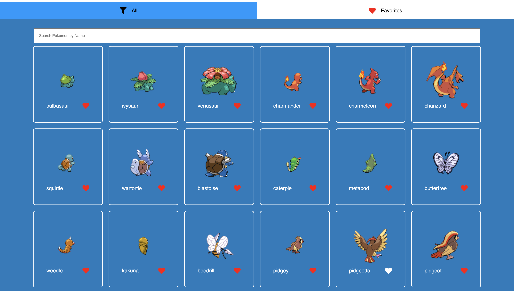
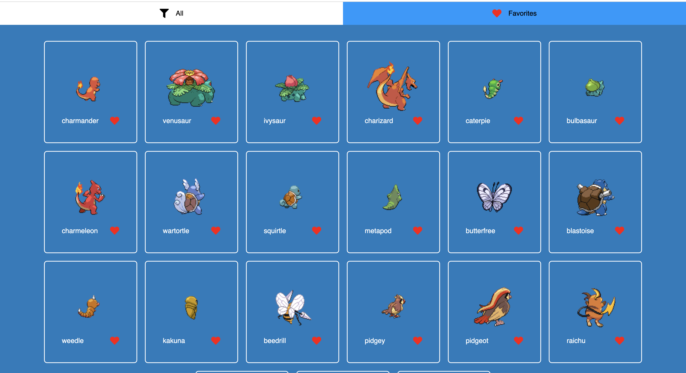
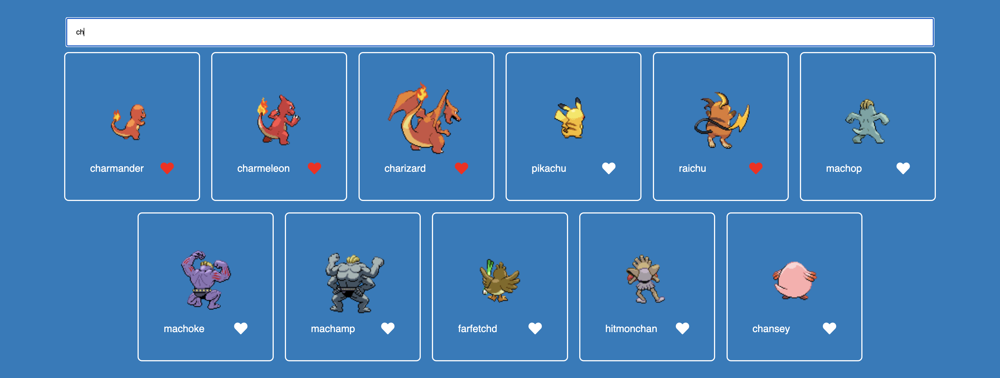

This is a [Next.js](https://nextjs.org/) project bootstrapped with [`create-next-app`](https://github.com/vercel/next.js/tree/canary/packages/create-next-app).

## A little about the project

A system to view the first 151 Pokemon ever created - written in React with next.js.

Use of the following services:
React Redux toolkit, Next.js

Deployed into netlify.

## Getting Started

First, run the development server:

```bash
npm run dev
# or
yarn dev
```

Open [http://localhost:3000](http://localhost:3000) with your browser to see the result.

## App example

All



Favorites



Searched pokemons


